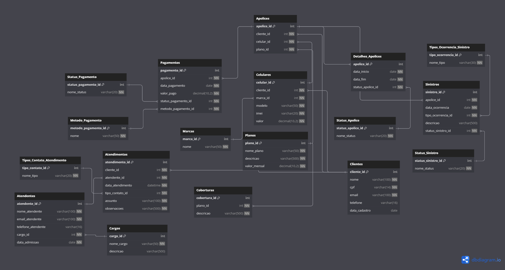

## SGBD escolhido 
-SQL SERVER 2022 

## Scripts SQL

Foram criados e testados os seguintes scripts:

- `sql/create_tables.sql`: Criação das tabelas.
- `sql/popule_tables.sql`: Inserção de dados de exemplo.

### Validação

- Scripts testados no SGBD: **SQL Server 2022**
- Execução sem erros.

## Diagrama Físico do Banco de Dados
Utilizamos a ferramenta de modelagem de dados dbdiagram.io para criação do modelo físico do banco de dados, para posterior exportação dos scripts DDL das tabelas e relacionamentos.
Arquivo fonte: https://dbdiagram.io/d/6847359357d78cbaf6a41bda.

